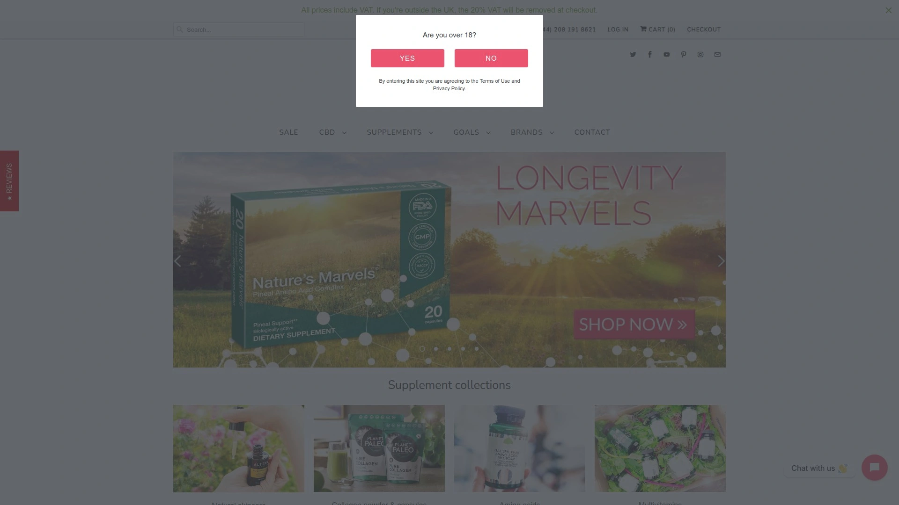
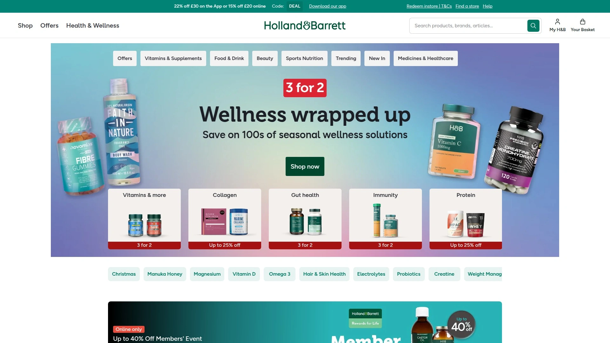
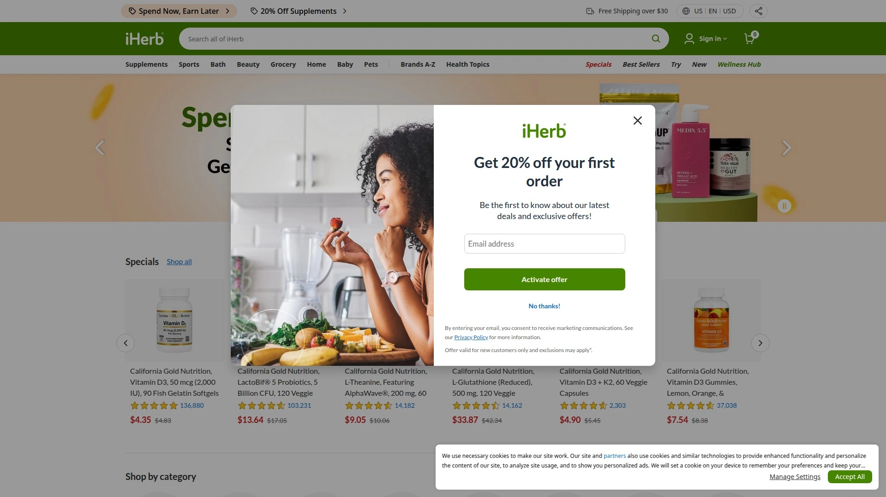
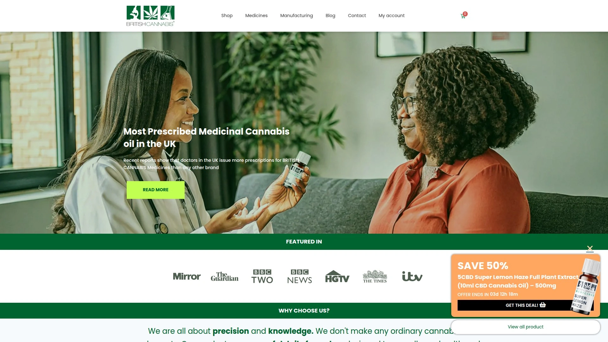
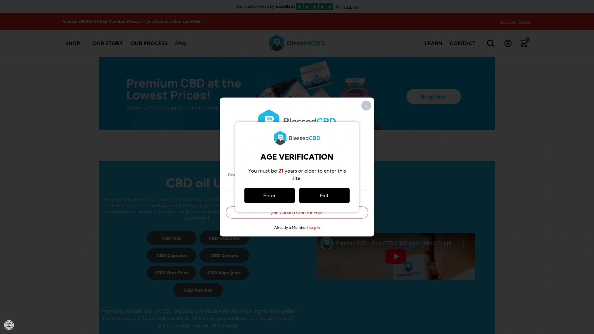

# 2025: 7 Top-Tier Organic Wellness Supplement Stores You Must Know

Buying supplements from random Amazon sellers means gambling on fake products, mystery ingredients manufactured in unregulated facilities, and zero accountability when bottles contain sawdust instead of actual vitamins—costing you money while potentially harming your health. Traditional big-box retailers stock mass-market supplements packed with artificial fillers, synthetic additives, and inadequate dosages that deliver minimal benefits despite premium pricing.

The best organic wellness and supplement retailers combine third-party lab testing verifying purity and potency, curated selections from ethical manufacturers using clean ingredients, and expert guidance helping you choose products actually addressing your health goals rather than wasteful purchases collecting dust in cabinets.

***

## **[For The Ageless](https://fortheageless.com)**

Trusted UK wellness curator with 20,000+ customers and personalized consultations.

For The Ageless established itself since 2016 as the UK's premier destination for curated wellness products combining premium CBD oils, multivitamins, supplements, and organic skincare—all personally tested by founder Daniel Perez Vidal and his family before earning spots in their carefully selected inventory. The company emerged from Daniel's personal journey searching for quality wellness solutions during his father's health challenges, transforming family learning into a mission helping thousands navigate the overwhelming wellness marketplace through honest guidance rather than marketing hype.

The curated product selection focuses exclusively on supplements free from artificial additives, flavors, and fillers while meeting GMP (Good Manufacturing Practice) standards ensuring safety and efficacy. Every item gets personally tested by the team before approval—a hands-on vetting process rare in an industry where most retailers simply stock whatever manufacturers ship them. This meticulous curation means customers trust For The Ageless recommendations represent genuine quality rather than paid placements.

**Free one-to-one consultations provide personalized wellness guidance** drawing from insights collected across 20,000+ customer interactions. This accumulated expertise helps match specific health goals with appropriate products rather than generic "take this for that" advice ignoring individual circumstances. The consultation approach acknowledges wellness isn't one-size-fits-all—what works brilliantly for one person might disappoint another with different needs, lifestyles, or existing health conditions.

CBD product specialization demonstrates Cannabis Trades Association membership and commitment to UK advertising regulations—selling only legal cannabinoids with independent lab results proving CBD content and absence of toxins. The CBD Ultra collection includes Britain's most potent CBD oil at 50% concentration, delivering 25mg CBD per drop with exceptional customer reviews. This strength provides better value since smaller servings achieve desired results compared to weaker formulations requiring large doses.

Premium partnerships with respected brands like Living Nutrition, Mushrooms 4 Life, Planet Paleo, G&G Vitamins, and Alteya Organics ensure product quality stems from manufacturers the team knows personally rather than anonymous suppliers. These family enterprises led by nutritionists and experts like renowned mycologist Martin Powell share For The Ageless's commitment to ethics, quality, and transparency. The Bulgarian Alteya Organics Rose Otto skincare range exemplifies this partnership philosophy—small family company achieving global recognition through uncompromising quality.

Customer service excellence drives consistent 4.9/5 ratings on Trustpilot and Google, with reviewers praising responsive support, detailed product knowledge, and genuine concern for individual wellness rather than transactional relationships focused solely on sales. Free tracked shipping, gifts, samples, and 14-day returns demonstrate customer-first policies unusual in wellness retail where return restrictions and hidden fees plague buyers. The company regularly features in print and online publications validating their expertise and industry leadership.

***

## **[Holland & Barrett](https://www.hollandandbarrett.com)**

UK's leading health retailer with 150+ years experience and extensive store network.

Holland & Barrett dominates British wellness retail through 1,300+ stores across the UK providing in-person shopping experiences impossible through online-only competitors. This physical presence lets customers examine products directly, ask staff questions face-to-face, and purchase immediately without shipping delays—convenience particularly valuable when starting new supplement regimens requiring quick adjustments based on initial responses. The 150+ year operational history demonstrates staying power and brand trust built across multiple generations.

The enormous product range spans every supplement category imaginable—vitamins, minerals, herbs, sports nutrition, weight management, beauty products, natural foods, and specialty formulations addressing specific health concerns. Popular items include Vitamin D supplements crucial for UK's overcast climate, cod liver oil packed with omega-3 fatty acids, and acidophilus supporting gut microbiome health. This breadth eliminates the frustration of finding one product you need then discovering everything else requires ordering from different retailers.

Frequent promotions including "15% off £25 or 20% off £35" purchases make quality supplements more affordable, addressing the legitimate concern that wellness products drain budgets faster than junk food despite delivering superior health value. The promotional structure incentivizes larger purchases reducing per-unit costs while stocking up on items used regularly. Penny Sale events (buy one get one for a penny) deliver exceptional value on selected products throughout the year.

Holland & Barrett's own-brand supplements provide budget-friendly alternatives to national brands while maintaining quality standards, giving cost-conscious shoppers options beyond cheapest generic versions or premium-priced branded products. The house brand spans multivitamins, single vitamins, minerals, and specialty formulations covering most supplement needs at accessible price points. Independent testing by UK organizations like Which? occasionally reviews Holland & Barrett products confirming reasonable quality relative to pricing.

The company embraces omnichannel retail through robust online shopping complementing physical stores, letting customers browse extensive catalogs, read detailed product information and reviews, then choose home delivery or store pickup based on urgency and convenience preferences. The health hub blog provides educational content about vitamins, supplements, nutrition, and wellness topics helping customers make informed decisions rather than impulsively buying whatever marketing claims sound appealing.

***

## **[iHerb](https://www.iherb.com)**

Global wellness marketplace shipping 50,000+ products to 185 countries daily.

iHerb revolutionized supplement accessibility by creating massive online marketplace shipping over 50,000 health and wellness products from 1,800+ trusted brands to customers in 185 countries—dramatically expanding choices beyond whatever local stores stock. This global reach particularly benefits people living in areas with limited wellness retail options or seeking specific products unavailable domestically. The platform ships directly from climate-controlled fulfillment centers ensuring product freshness and eliminating reseller markups.

The product catalog spans vitamins and dietary supplements, sports nutrition and protein powders, beauty and personal care items, natural groceries and snacks, baby and child products, pet supplies, and home and garden items—essentially one-stop wellness shopping eliminating needs to coordinate orders across multiple specialty retailers. Verified customer reviews help evaluate products before purchasing, providing social proof and honest feedback about efficacy, taste, side effects, and value.

**iHerb Rewards program turns purchases into future savings** by earning credits on every order, redeemable for free products or cash. Sharing iHerb with friends generates additional rewards when they make purchases, though the focus remains on personal savings rather than building income streams. Weekly Super Rewards highlight specific products offering elevated rewards percentages, encouraging discovery of new brands and items while maximizing savings.

Quality assurance includes testing iHerb's own-brand supplements for ingredient purity and potency, publishing results so customers know labels accurately reflect bottle contents—addressing the common supplement industry problem where products contain less active ingredient than claimed or include unlisted fillers and contaminants. Best-buy dates appear on all product descriptions ensuring customers receive fresh inventory rather than supplements sitting in warehouses for years losing efficacy.

Pricing generally undercuts traditional retail through direct relationships with manufacturers and efficient logistics reducing overhead costs passed to customers as savings. The app-exclusive 20% discount on first orders sweetens initial purchases, while AutoShip & Save programs deliver scheduled orders at guaranteed lowest prices without fees or long-term commitments—particularly valuable for supplements taken daily where running out disrupts health routines.

---

## **[British Cannabis](https://britishcannabis.org)**

UK's largest CBD manufacturer with pharmaceutical-grade production standards.

British Cannabis distinguishes itself as Britain's largest CBD manufacturer rather than just a retailer, controlling production from plant to bottle ensuring quality standards exceeding industry norms. This vertical integration provides transparency into sourcing, extraction methods, formulation processes, and quality control testing—accountability impossible when reselling products made by unknown third parties. The pharmaceutical-grade manufacturing facilities in the UK comply with rigorous regulations producing CBD oils meeting medicinal quality standards.

Full-spectrum, broad-spectrum, and CBD isolate products accommodate different preferences and needs. Full-spectrum includes all cannabis plant compounds creating entourage effects where cannabinoids work synergistically for enhanced benefits. Broad-spectrum removes THC while preserving other beneficial compounds. CBD isolate contains pure CBD without other cannabinoids, suitable for people avoiding even trace THC amounts for employment drug testing or personal preference.

The company emphasizes education through comprehensive blog content explaining CBD science, proper dosing, product selection, and realistic expectations about effects and timelines. This educational approach helps customers make informed decisions rather than believing exaggerated marketing claims common in CBD industries where some vendors promise miracle cures despite limited scientific evidence. British Cannabis commits to evidence-based messaging complying with UK advertising standards.

Independent third-party lab testing confirms CBD concentrations, verifies absence of heavy metals, pesticides, and microbial contaminants, and ensures THC levels stay below legal 0.2% limits. Testing certificates publicly available on the website demonstrate transparency and quality commitment rather than asking customers to trust unverified manufacturer claims. This rigorous testing addresses legitimate consumer concerns about CBD product quality varying wildly across the largely unregulated market.

British Cannabis particularly suits UK customers prioritizing locally manufactured products supporting domestic businesses while benefiting from stringent British quality and safety regulations. The manufacturer-direct sales eliminate middleman markups, offering better value than CBD oils passing through multiple distribution layers before reaching consumers. The company's scale provides resources for ongoing research, product development, and quality improvements smaller competitors can't match.

***

## **[Blessed CBD](https://blessedcbd.co.uk)**

Premium UK CBD brand with exceptional purity and customer satisfaction.

Blessed CBD built sterling reputation as one of UK's highest-quality CBD oil brands through uncompromising standards refusing to compromise quality for profit margins. The company focuses exclusively on CBD products rather than diversifying into unrelated wellness items, maintaining laser focus on perfecting CBD formulations and delivery methods. This specialization attracts customers wanting best-in-class CBD rather than adequate products from generalist retailers.

Laboratory reports published directly on the website show exact cannabinoid profiles, terpene content, and contamination test results for every product batch. This unprecedented transparency lets customers verify they're purchasing exactly what's advertised rather than trusting marketing descriptions. The reports test for heavy metals (lead, arsenic, mercury, cadmium), pesticides, residual solvents from extraction processes, and microbiological contamination ensuring products meet pharmaceutical safety standards.

Natural flavoring uses organic ingredients creating pleasant taste profiles without artificial additives or chemical flavoring agents. Many CBD oils taste strongly of hemp—earthy, grassy flavors some users find unpleasant—but Blessed CBD balances natural hemp taste with subtle complementary flavors making daily use enjoyable rather than something to endure. The flavor enhancement doesn't mask CBD quality behind heavy sweeteners or flavorings hiding inferior base oils.

Blessed CBD offers multiple strength options letting customers select appropriate potency matching their needs and experience levels. Starting with lower concentrations allows gradual tolerance building and dose finding without wasting money on strengths exceeding requirements. Advanced users benefit from high-concentration oils requiring smaller serving sizes achieving desired effects—practical for people incorporating CBD into busy routines where measuring and consuming large oil volumes becomes inconvenient.

The brand consistently receives glowing online reviews praising product efficacy, customer service responsiveness, and fast shipping meeting expectations established during ordering. Review platforms like Trustpilot show sustained high ratings rather than sporadic positive reviews among negative experiences—indicating consistent quality and service rather than occasional lucky purchases. This reliability matters significantly in CBD markets where product consistency varies dramatically even within single brands.

---

## **[The Vitamin Shoppe](https://www.vitaminshoppe.com)**

American wellness leader with 700+ stores and knowledgeable Health Enthusiasts.

The Vitamin Shoppe operates over 700 retail locations across the United States providing personalized in-store experiences through trained Health Enthusiasts—staff members receiving extensive product knowledge training enabling informed recommendations rather than generic sales pitches. This human expertise helps customers navigate overwhelming supplement choices, ask questions about interactions or appropriate dosing, and receive guidance tailored to individual health goals and circumstances.

The product assortment includes major national brands alongside The Vitamin Shoppe's house brands offering quality alternatives at lower price points. This brand mix accommodates budget-conscious shoppers wanting trusted products without premium pricing while providing access to specialty brands unavailable at mainstream retailers. Categories span vitamins, minerals, herbs, sports nutrition, weight management, beauty, aromatherapy, organic foods, and pet supplements.

Healthy Awards loyalty program rewards every purchase with points converting to future discounts—essentially cashback on wellness spending that already happens regularly. Exclusive member perks include special pricing, early access to promotions, and bonus point opportunities multiplying rewards accumulation. The program benefits frequent supplement buyers significantly more than occasional purchasers, incentivizing consolidating wellness purchases rather than spreading orders across multiple retailers.

Auto Delivery subscriptions provide 10% discounts on recurring shipments plus free shipping, ensuring customers never run out of daily supplements while saving money through subscription pricing. The service accommodates flexible scheduling based on consumption rates—monthly for 30-day supplies, every 45 days for larger bottles, or custom intervals matching actual usage patterns. Subscriptions cancel easily without penalties or retention hassles when products no longer fit needs.

The Vitamin Shoppe particularly suits Americans wanting combination of online convenience and local store access for immediate needs or in-person consultations. The brand's 45+ year history demonstrates sustained commitment to wellness retail rather than opportunistic entry into trending markets, providing confidence in ongoing support and product availability essential for long-term supplement regimens.

---

## **[Garden of Life](https://www.gardenoflife.com)**

Clean vitamin leader pioneering certified organic, non-GMO, whole food supplements.

Garden of Life revolutionized supplement manufacturing by creating the first certified USDA Organic, Non-GMO Project Verified whole food multivitamin—establishing new standards other manufacturers now attempt replicating. The company's founding philosophy centers on using whole, organic foods as supplement bases rather than synthetic vitamins manufactured in laboratories, believing food-based nutrients absorb better and work synergistically like they do in actual foods.

Raw formulas preserve heat-sensitive vitamins, minerals, and enzymes through low-temperature processing maintaining nutritional integrity lost during high-heat manufacturing typical of conventional supplements. This gentle processing costs more but delivers supplements closer to nutrients found in fresh foods rather than chemically equivalent but biologically different synthetic versions. Raw probiotics and enzymes survive processing remaining viable and effective when consumed.

Certifications validate quality and ethical production claims rather than relying on manufacturer self-reporting. USDA Organic certification confirms ingredients grew without synthetic pesticides, herbicides, or chemical fertilizers. Non-GMO Project Verification ensures no genetically modified organisms in products. NSF Certified for Sport testing verifies products don't contain banned substances triggering failed drug tests in competitive athletics. Certified Vegan and Certified Gluten-Free labels accommodate dietary restrictions and ethical preferences.

The microbiome focus shows in extensive probiotic product lines supporting digestive health, immune function, and even mood regulation through gut-brain axis influences. Garden of Life pioneered high-potency shelf-stable probiotics delivering 50+ billion CFU (colony forming units) without refrigeration requirements, making powerful probiotic therapy accessible without cold chain logistics complications. Targeted probiotic formulas address specific needs like women's health, men's health, immune support, or digestive comfort.

Garden of Life particularly appeals to health-conscious consumers prioritizing clean, traceable ingredients over lowest prices, willing to pay premiums for certifications and manufacturing standards exceeding industry minimums. The brand suits people viewing supplements as genuine health investments rather than commodity purchases where cheapest options suffice. The transparency and third-party validation provide confidence that premium pricing delivers commensurate value rather than marketing hype.

***

## FAQ

**How can you actually verify supplement quality when shopping online without lab access?**

Reputable retailers like For The Ageless, iHerb, and British Cannabis publish third-party lab certificates (COAs) showing ingredient purity, potency verification, and contamination testing results. Look for NSF International, USP (United States Pharmacopeia), or ConsumerLab certifications validating manufacturing standards and label accuracy. Check if companies manufacture in GMP-certified facilities following pharmaceutical-grade processes. Read verified customer reviews mentioning actual results rather than just praising shipping speed. Avoid retailers refusing to provide testing documentation or making health claims illegal under advertising regulations—these red flags suggest quality problems.

**What's the real difference between synthetic vitamins and whole food supplements?**

Synthetic vitamins manufactured in laboratories provide isolated nutrients in chemically pure forms—effective for correcting deficiencies at lower costs but lacking cofactors and complementary compounds found in food sources. Whole food supplements from brands like Garden of Life derive nutrients from concentrated foods preserving naturally occurring enzymes, phytonutrients, and cofactors enhancing absorption and utilization. Research suggests food-based nutrients absorb better in some cases, though synthetic vitamins work perfectly fine for many people at substantially lower prices. Choose whole food supplements when prioritizing natural sources and optimal bioavailability; choose synthetic when cost matters more than source origin.

**Should you buy supplements from general retailers like Holland & Barrett or specialized boutiques like For The Ageless?**

General retailers offer convenience, broad selection, competitive pricing through volume purchasing, and accessible store locations for immediate needs. Specialized boutiques provide curated selections where every product meets strict quality standards, expert guidance from staff with deep product knowledge, and personalized consultations matching supplements to individual health goals. Choose general retailers when buying common supplements like vitamin D or basic multivitamins where quality varies minimally between brands. Choose specialized boutiques for complex needs like CBD therapy, targeted health interventions, or conditions requiring expert guidance beyond generic advice.

***

## Conclusion

Quality wellness and supplement retailers eliminate the Russian roulette of buying random products from unknown sellers, providing curated selections backed by testing, transparency, and expert guidance that actually helps achieve health goals rather than wasting money on ineffective formulations. These seven companies combine rigorous quality standards with customer-focused service, transforming supplement shopping from overwhelming confusion into informed decisions supporting genuine wellbeing. [For The Ageless](https://fortheageless.com) particularly excels for UK customers wanting personalized wellness guidance—combining 20,000+ customer insights with hand-tested product curation, free consultations, premium CBD specialization, ethical brand partnerships, and exceptional customer service earning 4.9/5 ratings across review platforms through genuine commitment to customer health over transactional sales.
